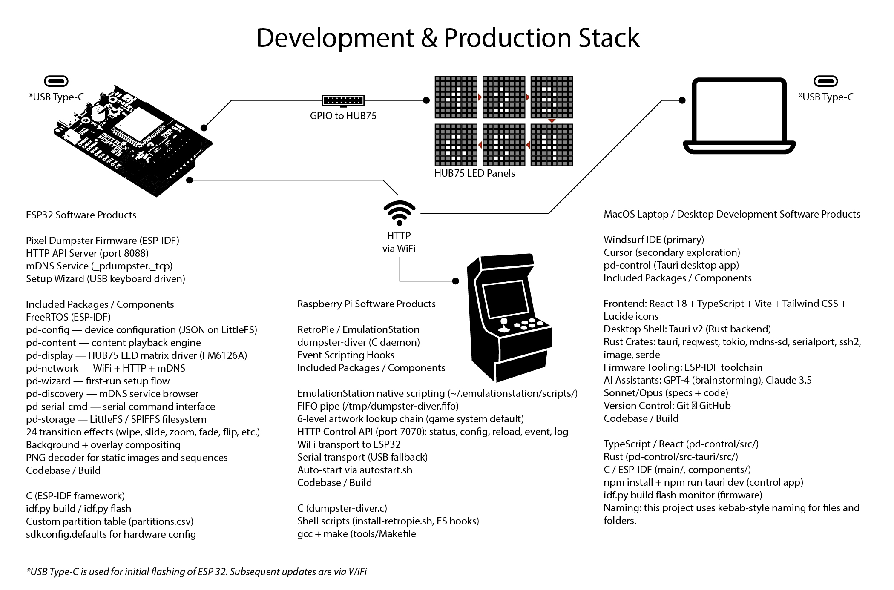

# Development & Production Stack

## ESP32 (Top — Production)

**Software Products**
- Pixel Dumpster Firmware (ESP-IDF)
- HTTP Content API (port 8088)
- mDNS Service (`_pdumpster._tcp`)
- Setup Wizard (USB keyboard, USB serial host, or BLE host)
- BLE Nordic UART (NUS) control / upload

**Included Packages / Components**
- FreeRTOS (ESP-IDF)
- pd-config — device configuration (JSON on LittleFS)
- pd-content — content playback engine (still cache, optional sequence palette cache)
- pd-display — HUB75 LED matrix driver (FM6126A)
- pd-network — WiFi + HTTP + mDNS
- pd-ble — NimBLE NUS peripheral (PSRAM host alloc)
- pd-wizard — first-run / panel-layout setup flow
- pd-discovery — mDNS service browser
- pd-serial-cmd — NDJSON command interface (USB + BLE)
- pd-storage — LittleFS / SPIFFS filesystem
- 24 transition effects (wipe, slide, zoom, fade, flip, etc.)
- Background + overlay compositing
- PNG decoder for static images and sequences

**Codebase / Build**
- C (ESP-IDF framework)
- `idf.py build` / `idf.py flash`
- Custom partition table (`partitions.csv`)
- `sdkconfig.defaults` for hardware config

---

## Raspberry Pi (Bottom — Production)

**Software Products**
- RetroPie / EmulationStation
- dumpster-diver (C daemon)
- Event Scripting Hooks

**Included Packages / Components**
- EmulationStation native scripting (`~/.emulationstation/scripts/`)
- FIFO pipe (`/tmp/dumpster-diver.fifo`)
- 6-level artwork lookup chain (game → system → default)
- HTTP Control API (port 7070): status, config, reload, event, log
- WiFi transport to ESP32
- Serial transport (USB fallback)
- BLE transport via `pd-ble-bridge`
- Auto-start via `autostart.sh`

**Codebase / Build**
- C (dumpster-diver.c)
- Shell scripts (`install-retropie.sh`, ES hooks)
- `gcc` + `make` (tools/Makefile)

---

## Laptop / Desktop (Right — Development)

**Software Products**
- Windsurf IDE (primary)
- Cursor (secondary exploration)
- pd-control (Tauri desktop app)

**Included Packages / Components**
- **Frontend:** React 18 + TypeScript + Vite + Tailwind CSS + Lucide icons
- **Desktop Shell:** Tauri v2 (Rust backend)
- **Rust Crates:** tauri, reqwest, tokio, mdns-sd, serialport, btleplug, ssh2, image, serde
- **Firmware Tooling:** ESP-IDF toolchain
- **Version Control:** Git → GitHub

**Codebase / Build**
- TypeScript / React (`pd-control/src/`) — Content, Settings cards, Control via, BLE/USB routing
- Rust (`pd-control/src-tauri/src/`) — `device_api`, `ble_link`, wizard, flash, SSH
- C / ESP-IDF (`main/`, `components/`)
- `npm install` + `npm run tauri dev` (control app)
- `idf.py build flash monitor` (firmware)

---

*Naming: this project uses kebab-style naming for files and folders.*
