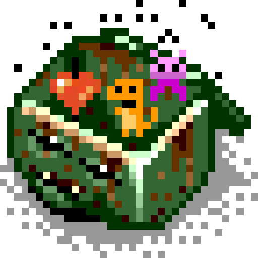

# pixel-dumpster

<p align="center">
  
</p>

## Your infinite bin of pixel-punk trash

An open-source alternative to commercial arcade marquee systems, built on ESP32 and HUB75 LED panels. Pixel Dumpster displays game art, animated sequences, and transitions on your cabinet's marquee — automatically, as you play — driven by your RetroPie setup over WiFi, with BLE and USB as control fallbacks when the device is offline.

> ⚠️ **Early/experimental.** Core features work but expect rough edges. Hardware bring-up, configuration, and content management all require some technical patience.

---

## What it does

```
RetroPie (EmulationStation)
        │  scripting hooks
        ▼
  dumpster-diver          ← daemon running on your Pi
  (game/system events)
        │  WiFi / HTTP  (or BLE bridge / USB serial)
        ▼
   ESP32 firmware         ← flashed to your display board
        │  HUB75
        ▼
  LED matrix panel        ← your marquee

  pd-control (desktop) ── WiFi / BLE / USB ──► ESP32
```

When you select a game in EmulationStation, `dumpster-diver` detects the event and pushes the matching marquee artwork to your ESP32 (WiFi by default; BLE or USB when configured). The display transitions to the new image automatically. No commercial software, no subscriptions.

---

## Components

### ESP32 Firmware (`main/` + `components/`)
The heart of the system. Runs on an ESP32-S3 connected directly to HUB75 LED panels via ribbon cable. Handles:
- HUB75 panel driving (FM6126A shift driver, configurable scan mode and orientation)
- WiFi connection and mDNS advertising (`_pdumpster._tcp` on port 8088)
- HTTP Content API for playback, configuration, upload, and OTA
- BLE Nordic UART (NUS) carrying the same NDJSON control/upload protocol as USB
- 24 transition types (wipe, slide, zoom, fade, flip, and more)
- Background/overlay compositing; optional sequence palette cache; static PNG still cache
- LittleFS storage for config and content

### pd-control (`pd-control/`)
A cross-platform desktop app (Tauri + React) for managing your devices without touching a terminal. Features:
- Auto-discovers ESP32 devices and `dumpster-diver` daemons via mDNS
- Content browser, playback, and local PNG upload over WiFi, BLE, or USB
- Settings cards (USB / Bluetooth / WiFi / layout / playback / brightness)
- Control-via preference when multiple transports are connected
- Panel-layout wizard over USB or BLE; Launch Wizard tours Settings
- ESP32 firmware flasher and Raspberry Pi SSH installer for `dumpster-diver`

Requires Rust 1.70+ and Node 18+. See [`pd-control/README.md`](pd-control/README.md).

### dumpster-diver (`tools/dumpster-diver.c`)
A lightweight C daemon that runs on your RetroPie Pi and bridges EmulationStation events to your display. It:
- Hooks into EmulationStation's native scripting system (no custom ES builds needed)
- Watches for game-select, game-launch, game-end, and system-select events
- Walks a 6-level artwork lookup chain to find the best matching image
- Pushes content via WiFi HTTP, USB serial, or BLE (`pd-ble-bridge`)
- Exposes a control API on port 7070 for `pd-control` to monitor and manage

See [`documentation/dumpster-diver.md`](documentation/dumpster-diver.md).

### Content System (`content/`)
Images and animated sequences stored on the device or pushed from the Pi. Supports:
- Static PNG images (auto-scaled to panel resolution)
- Animated sequences — ordered PNG frames with `meta.json` timing metadata
- Background and overlay compositing layers
- Per-item transition, duration, and display overrides via `meta.json`

See [`documentation/api.md`](documentation/api.md) for the full HTTP API reference.

---

## Hardware

| Part | Notes |
|------|-------|
| ESP32-S3 dev board | Any board with enough GPIO; confirm HUB75 pinout |
| HUB75 LED matrix panels | 32×64 pixels per panel; chain up to 7 for 224×64 total |
| FM6126A shift driver | Confirmed working; standard driver also supported |
| 5V power supply | Sized for your panel count — panels draw ~3–4A each at full white |
| USB keyboard | Optional; first-time setup can also use `pd-control` over USB/BLE |

Panel resolution, chain length, orientation (0/90/180/270°), and scan mode are configurable via the hardware wizard (USB keyboard, or `pd-control` Panel Layout over USB/BLE) and later in Settings.

---

## Getting Started

### 1. Flash the firmware

Use `pd-control` (easiest) or flash manually with ESP-IDF:

```bash
# Install ESP-IDF, then:
idf.py build flash monitor
```

### 2. Configure the device

Preferred: open **pd-control → Settings**, connect **USB** or **Bluetooth**, and use the Layout card (“Configure panels over USB/BLE”) plus WiFi card for credentials. **Launch Wizard** tours the Settings cards.

Alternatively, connect a USB keyboard on first boot for the on-device wizard (panel size, scan/orientation, WiFi, device name).

After WiFi is configured, the device advertises as `pixel-dumpster.local` (`_pdumpster._tcp` on port 8088). BLE remains available for offline control.

### 3. Install dumpster-diver on your Pi

SSH into your RetroPie and run the install script:

```bash
bash tools/install-retropie.sh
```

This installs the daemon, registers EmulationStation scripting hooks, and adds `dumpster-diver` to autostart. Edit `~/.config/dumpster-diver/config.json` to point at your ESP32's IP or hostname (or configure BLE/serial transport — see the daemon docs).

### 4. Open pd-control

Launch `pd-control` on your desktop. It discovers ESP32 devices and the Pi daemon via mDNS. Use **Content** to play or **Upload PNG**, **Settings** for transports and layout, and the Pi panel for the daemon log. Without WiFi, connect BLE or USB and use Content with the remembered device.

### 5. Add content

Upload PNGs from Content in `pd-control`, or sync artwork via `dumpster-diver`. Animated sequences are folders of frames plus `meta.json`. Lookup order for RetroPie art is documented in [`documentation/dumpster-diver.md`](documentation/dumpster-diver.md).

---

## Documentation

| File | Contents |
|------|----------|
| [`documentation/api.md`](documentation/api.md) | ESP32 HTTP Content API (+ alternate transports) |
| [`documentation/ble-transport.md`](documentation/ble-transport.md) | BLE NUS NDJSON control and upload |
| [`documentation/dumpster-diver.md`](documentation/dumpster-diver.md) | Daemon setup, config, and event protocol |
| [`documentation/wizard-protocol.md`](documentation/wizard-protocol.md) | Setup wizard serial / BLE protocol |
| [`documentation/transitions.md`](documentation/transitions.md) | Transition types and playback notes |
| [`documentation/development.md`](documentation/development.md) | Build environment and development notes |
| [`pd-control/README.md`](pd-control/README.md) | Control app build and architecture |

---

## Troubleshooting

**Display is blank after wizard completes**
- Verify HUB75 ribbon cable orientation and pinout
- Check that panel power supply is on before the ESP32 boots
- Monitor serial output: `idf.py monitor`

**WiFi not connecting**
- Double-check SSID and password entered during wizard (case-sensitive)
- Confirm the network is 2.4 GHz — ESP32 does not support 5 GHz

**dumpster-diver not finding artwork**
- Check `config.json` on the Pi: `host` must point to your ESP32's IP
- Verify EmulationStation scripting hooks are installed in `~/.emulationstation/scripts/`
- Use `pd-control`'s daemon log view to see what events are being received and what artwork paths are being searched

**pd-control doesn't see the device**
- Confirm ESP32 is on the same LAN as your desktop
- Try adding the device manually by IP in pd-control's sidebar
- Check that mDNS is not blocked by your router or firewall
- For offline control: Settings → Bluetooth (scan/connect) or USB, then open Content — the app restores the last remembered device

**BLE connect fails / no permission (macOS)**
- Allow Bluetooth for `pd-control` in System Settings → Privacy & Security
- Confirm the device is advertising (name like `pixel-dumpster` / your hostname)
- See [`documentation/ble-transport.md`](documentation/ble-transport.md)

---

## Contributing

Fork the repo, create a branch, make your changes, and open a pull request. Issues and feedback welcome — this is an early project and rough edges are expected.

---

## License

No license file yet — coming soon.

---

*Naming: this project uses kebab-style naming for files and folders. See [`documentation/kebab-style-naming.md`](documentation/kebab-style-naming.md).*
